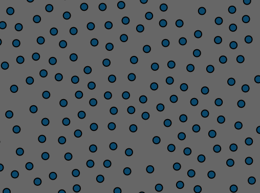

# Poisson-Disc Sampling
Creates a random sample distribution with blue noise properties, with minimal cluttering and even spacing. This implementation in particular uses Bridson's algorithm, which is guaranteed to run in O(n) time.

### References
 - https://www.cs.ubc.ca/~rbridson/docs/bridson-siggraph07-poissondisk.pdf
 - https://bl.ocks.org/mbostock/19168c663618b7f07158
 - https://www.jasondavies.com/poisson-disc/
